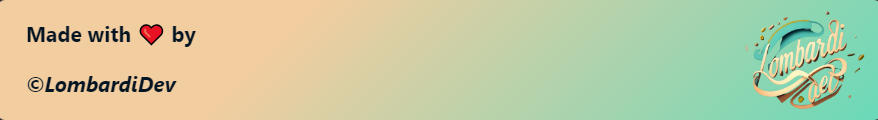

# 

## About 👨🏻‍💻

  
 
    I am a Functional Analyst with over 5 years of experience in web development and enterprise systems, certified as a Product Owner. Throughout my career, I have led and managed tech projects for multinational companies and startups in accelerated growth stages, working on implementing solutions tailored to meet client needs. My approach combines technical skills as a Fullstack Developer with strategic capabilities, allowing me to deliver end-to-end solutions from planning to execution. Additionally, I possess a flexible and entrepreneurial mindset, quickly adapting to different environments and teams.
  

  

If you are interested in knowing more about me you are in the right place.

## You can find in me in the web 🌎

 
 
 

## Technical Skills 🛠

### Learning / To Learn 📚

## Tech & Tools Stats 📈

