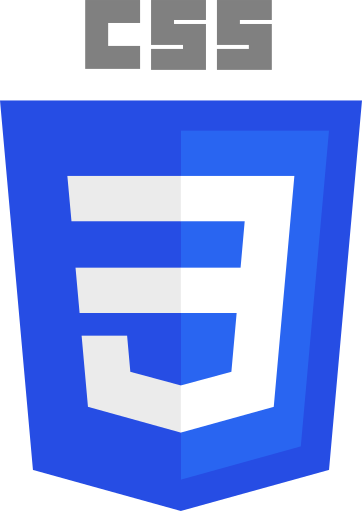
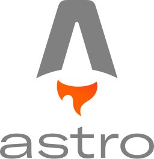
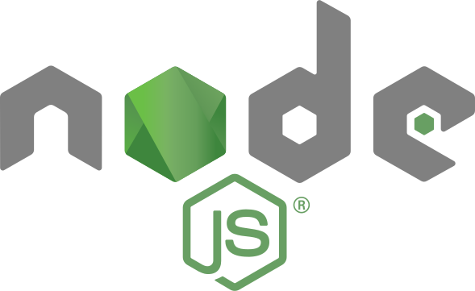

# 

## About

I have been working in the programming world for **+5 years**. Currently I work as a **Functional Analyst** and I am a **Full Stack Web Developer**. During my career in systems I have been fond of programming so I decided to expand my knowledge as a developer. **Through my experience in Data Analysis, I have acquired skills in programming, planning and complex problem solving.**
If you are interested in knowing more about me you are in the right place.

 

## You can find in me in the web 🌍

 
 
 

## Technical Skills

    
    
    
    
    
    
    
    
    
    

### Learning / To Learn

    
    
    
    

## Tech & Tools Stats

